# UMPIRE-Run: AI-Assisted Data Structures and Algorithms Practice

UMPIRE-Run is a cloud-native application designed to assist software engineering candidates, computer science students, and seasoned developers in honing their algorithmic problem-solving skills through an AI-guided approach. Leveraging AWS services and the UMPIRE problem-solving method, this platform offers structured guidance on technical challenges, making preparation for software engineering interviews more efficient and effective.

---

## Table of Contents
- [Introduction](#introduction)
- [Target Users](#target-users)
- [Performance Targets](#performance-targets)
- [Architecture Overview](#architecture-overview)
  - [AWS Services](#aws-services)
- [System Architecture](#system-architecture)
  - [Key Components](#key-components)
  - [Client Layer](#client-layer)
  - [AWS Public VPC](#aws-public-vpc)
  - [Application Layer](#application-layer)
  - [AWS Services Integration](#aws-services-integration)
  - [Security Features](#security-features)
  - [Network Configuration](#network-configuration)
- [System Components](#system-components)
  - [Data Flow](#data-flow)
  - [Programming Languages and Tools](#programming-languages-and-tools)
  - [Cloud Deployment](#cloud-deployment)
- [Security](#security)
  - [Measures](#measures)
  - [Vulnerabilities and Mitigations](#vulnerabilities-and-mitigations)
- [Cost Monitoring](#cost-monitoring)
- [Future Enhancements](#future-enhancements)
- [References](#references)

---

## Introduction
**UMPIRE-Run** aims to revolutionize the preparation for technical interviews by guiding users through coding problems using the **UMPIRE** method:
1. **Understand**
2. **Match**
3. **Plan**
4. **Implement**
5. **Review**
6. **Evaluate**

This structured approach enables effective revision, improves recall, and enhances problem-solving skills.

## Target Users
- **Software Engineering Candidates** preparing for technical interviews.
- **Computer Science Students** seeking to improve problem-solving abilities.
- **Experienced Developers** wanting to stay sharp with algorithmic challenges.

## Performance Targets
- **Fast Loading:** Problem statements and generated questions load within 3-5 seconds.
- **Concurrency:** Supports up to 100 simultaneous user sessions.
- **High Availability:** 99.9% uptime, ensuring consistent access.
- **Data Security:** Secure storage and transmission of user data and problem solutions.

## Architecture Overview
UMPIRE-Run is built using a hybrid deployment model that combines the advantages of **Infrastructure as a Service (IaaS)** and **Platform as a Service (PaaS)**. This setup balances control and management efficiency for optimal performance and scalability.

### AWS Services
The application leverages the following AWS services:
1. **Amazon EC2:** Hosts the core application, providing granular control over the runtime environment.
2. **Amazon S3:** Stores problem data and solutions securely.
3. **AWS Lambda:** Handles asynchronous tasks such as saving generated questions.
4. **Amazon DynamoDB:** Stores generated questions, offering high scalability and quick retrieval.
5. **AWS Secrets Manager:** Manages sensitive data like API keys.
6. **Amazon VPC:** Provides network isolation and enhances security.

## 🏗️ System Architecture

Our system follows AWS best practices with a secure, scalable architecture:

### Infrastructure Overview

```mermaid
flowchart LR
    subgraph Users["Client Layer"]
        U["👥 Users"]
    end

    subgraph VPC["AWS Public VPC"]
        IG[("Internet Gateway")]
        
        subgraph EC2["Application Layer"]
            direction TB
            APP["🖥️ EC2 Instance\n(React + Node.js)"]
            DOCKER["🐳 Docker Container"]
        end
        
        subgraph Networking["Network Layer"]
            SG["🔒 Security Group"]
            SUBNET["Subnet\n172.16.0.0/16"]
        end
    end
    
    subgraph AWS["AWS Services"]
        direction TB
        S3["📦 Amazon S3\nProblem Storage"]
        SM["🔐 Secrets Manager\nAPI Keys"]
        Lambda["λ AWS Lambda\nAsync Processing"]
        DB[("🗄️ DynamoDB\nQuestion Storage")]
    end

    %% Connections
    U -->|"HTTPS"| IG
    IG -->|"Port 443"| SG
    SG --> APP
    APP --> DOCKER
    
    %% AWS Service Connections
    APP -->|"Read/Write"| S3
    APP -->|"Fetch Keys"| SM
    APP -->|"Trigger"| Lambda
    Lambda -->|"Store"| DB
    
    %% Styling
    classDef vpc fill:#e6f3ff,stroke:#3b82f6,stroke-width:2px
    classDef service fill:#fdf2f8,stroke:#db2777,stroke-width:2px
    classDef network fill:#ecfdf5,stroke:#059669,stroke-width:2px
    classDef users fill:#f3f4f6,stroke:#4b5563,stroke-width:2px
    
    class VPC vpc
    class AWS service
    class Networking network
    class Users users
```

### Key Components

#### Client Layer
- Users access the application through HTTPS
- Secure TLS encryption for all communications

#### AWS Public VPC
- Custom VPC with defined subnet ranges
- Internet Gateway for public access
- Security Groups for granular access control

#### Application Layer
- EC2 instances running containerized applications
- Docker containers for consistent deployment
- Auto-scaling capabilities based on demand

#### AWS Services Integration
- **Amazon S3**: Stores LeetCode problems and solutions
- **Secrets Manager**: Secures API keys and credentials
- **Lambda**: Handles asynchronous processing
- **DynamoDB**: Manages question storage and retrieval

#### Security Features
- All internal communications within VPC
- HTTPS-only external access
- IAM roles for service-to-service communication
- Security groups with principle of least privilege

### Network Configuration
- VPC Subnet: 172.16.0.0/16
- Multiple availability zones for high availability
- Private subnets for enhanced security
- Public subnets only for load balancers and bastions

## System Components
The UMPIRE-Run architecture is built to be both modular and scalable.

1. **Frontend:** A React-based web application hosted on EC2.
2. **Backend API:** A Node.js/Express server on EC2 for handling requests and AI interactions.
3. **AI Service:** An OpenAI API integration generates questions based on the UMPIRE methodology.
4. **Data Storage:** 
   - **Amazon S3** for problem and solution storage.
   - **DynamoDB** for generated questions.
5. **Serverless Functions:** AWS Lambda for managing asynchronous tasks.
6. **Networking:** Custom VPC for security and isolation.
7. **Secrets Management:** AWS Secrets Manager for securely managing API keys.

### Data Flow
1. User selects a problem on the web interface.
2. The frontend requests problem data from the backend.
3. Backend retrieves problem details from S3.
4. The AI service generates UMPIRE-method questions.
5. Generated questions are sent to the frontend and saved to DynamoDB asynchronously via Lambda.
6. User interacts with questions, receiving immediate feedback.

### Programming Languages and Tools
- **Frontend:** TypeScript with React (Next.js)
- **Backend:** Node.js with Express
- **Lambda Functions:** Python
- **Infrastructure as Code:** Terraform for consistent, reproducible deployments

### Cloud Deployment
Deployment is managed using **Terraform** for an automated, version-controlled infrastructure setup, allowing seamless scaling and easy modifications.

## Security
### Measures
1. **Data in Transit:** Encrypted via HTTPS (TLS 1.2+).
2. **Data at Rest:** S3 buckets and DynamoDB tables are encrypted using AWS-managed keys.
3. **Access Control:** IAM roles and policies are in place to restrict access.
4. **Secrets Management:** API keys and sensitive credentials are securely stored in AWS Secrets Manager.
5. **Network Security:** Custom VPC, security groups, and Network ACLs are configured for maximum security.

### Vulnerabilities and Mitigations
1. **AI Model API Key Exposure:** Regular API key rotation and monitoring usage patterns help prevent misuse.
2. **Access Control:** Regular audits ensure permissions are updated and restricted based on the principle of least privilege.

## Cost Monitoring
The most significant cost factor in UMPIRE-Run is **Amazon EC2** usage. To manage potential cost escalation:
- **AWS Cost Explorer** provides insights into usage patterns.
- **CloudWatch alarms** help monitor instances to avoid over-provisioning or leaving instances running unnecessarily.

## Future Enhancements
To expand UMPIRE-Run's features and improve user experience, we plan to add:
1. **User Progress Tracking:** Track performance over time with Amazon Redshift.
2. **Collaborative Problem Solving:** Real-time collaboration using ElastiCache.
3. **Mobile App Integration:** iOS and Android support with AWS AppSync for synchronization.
4. **Advanced Authentication:** Allow multi-method login (email, Google, GitHub).
5. **RAG-based Improvements:** Enhanced question generation based on user performance data.

## References
1. [Dell PowerEdge R750](https://www.dell.com/en-us/shop/povw/poweredge-r750)
2. [Synology RS4021xs+](https://www.synology.com/en-us/products/RS4021xs+)
3. [MongoDB Enterprise Pricing](https://www.mongodb.com/pricing)
4. [Cisco Catalyst Switches](https://www.cisco.com/c/en/us/products/switches/catalyst-9300-series-switches/index.html)

For additional details, please refer to the full project report.

---
